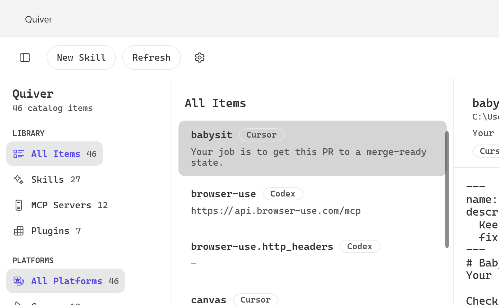

<div align="center">

# Quiver

**Your agent toolkit, in one quiver.**

A native **Windows** app to browse, edit, and manage your local AI‑tool assets —
**skills**, **MCP servers**, and **plugins** — across Cursor, Claude Code, Codex, Hermes, Pi,
and OpenCode.

[**Website**](https://kopachelli.github.io/quiver/) · [**Download**](https://github.com/Kopachelli/quiver/releases/latest)



</div>

---

Quiver scans the agent dotfolders under your home directory (`%USERPROFILE%\.cursor`, `\.claude`,
`\.codex`, `\.hermes`, `\.pi`, `\.openclaw`, plus the shared `\.agents\skills`) and gives you one
place to inspect and edit the files these tools otherwise scatter across hidden folders. It's a
genuinely native app — WPF, no web view, no Electron.

## Download

Grab the latest from the [**Releases page**](https://github.com/Kopachelli/quiver/releases/latest):

- **Quiver‑Setup.exe** — installer (Start‑menu shortcut + uninstaller). Recommended.
- **Quiver‑portable.exe** — single portable `.exe`, no install needed.

Both are self‑contained (no .NET install required), for Windows 10/11 (x64). They're unsigned, so
SmartScreen shows a one‑time *"Windows protected your PC"* prompt → **More info → Run anyway**.

## Features

- **Catalog discovery** across all six tools — skills (`SKILL.md` + frontmatter, built‑in Cursor,
  plugin‑embedded, shared `~/.agents/skills` dedup), MCP servers (Cursor `mcp.json`, Claude
  `.mcp.json`, Codex `config.toml`), and plugins — plus installed‑vs‑not source detection.
- **Three‑pane browser** — sidebar (library + platform filters with live counts), searchable list,
  detail pane. Fluent design with an indigo accent, light/dark/system themes.
- **Skill editor** — AvalonEdit with frontmatter‑aware files, multi‑file tree, 1.2 s debounced
  autosave, atomic UTF‑8 (no BOM) writes.
- **MCP & plugin detail** views (read‑only cards + reveal/open/copy actions).
- **CRUD** — New / Rename / Delete / Edit‑metadata dialogs with validation and capability gating.
- **Onboarding & settings** — first‑run setup, appearance, library filters, editor font size.
- **Live refresh** — `FileSystemWatcher` per root + refresh on window activation.
- **Keyboard shortcuts** — Ctrl+N, Ctrl+R / F5, Ctrl+S, Ctrl+B, Ctrl+Alt+I.

## Tech stack

WPF · .NET 8 (LTS) · WPF‑UI (Fluent/Mica) · CommunityToolkit.Mvvm ·
Microsoft.Extensions.DependencyInjection · AvalonEdit. Config parsing uses System.Text.Json plus a
faithful port of a minimal frontmatter/TOML reader (no third‑party YAML/TOML).

## Build from source

Requires the **.NET 8 SDK**.

```powershell
dotnet build src/SkillzWin/SkillzWin.csproj -c Debug
dotnet run   --project src/SkillzWin/SkillzWin.csproj
```

### Package

```powershell
# portable single-file exe
dotnet publish src/SkillzWin/SkillzWin.csproj -c Release -r win-x64 --self-contained true `
  -p:PublishSingleFile=true -p:IncludeNativeLibrariesForSelfExtract=true `
  -p:EnableCompressionInSingleFile=true -o publish

# installer (folder payload + Inno Setup)
dotnet publish src/SkillzWin/SkillzWin.csproj -c Release -r win-x64 --self-contained true -o publish-app
& "$env:LOCALAPPDATA\Programs\Inno Setup 6\ISCC.exe" installer\Quiver.iss
```

## Project layout

```
src/SkillzWin/
  Models/      domain records + enums
  Services/    paths, scanners (skill/mcp/plugin), detector, file I/O, watcher, theme
  ViewModels/  catalog store, shell, editor, settings, onboarding, dialogs
  Views/       MainWindow, panes, components, dialogs, settings, onboarding
  Themes/      color/typography/spacing/control dictionaries + converters
docs/          reverse-engineering spec + implementation plan
installer/     Inno Setup script
```

## License & acknowledgements

Released under the **MIT License** (see [LICENSE](LICENSE)). Free and open source — a paid edition
with extra features may follow later.

Quiver is an **independent, from‑scratch C#/WPF application** whose design and feature set were
**inspired by** [robzilla1738/skillz-macos](https://github.com/robzilla1738/skillz-macos). No source
code or artwork was copied; the name, icon, theme, and implementation are original. UI glyphs come
from the Fluent System Icons shipped with WPF‑UI (MIT). Thanks to that project for the original idea.
